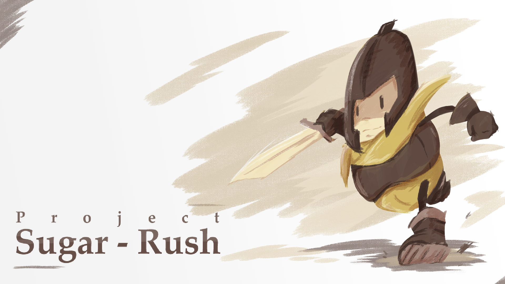
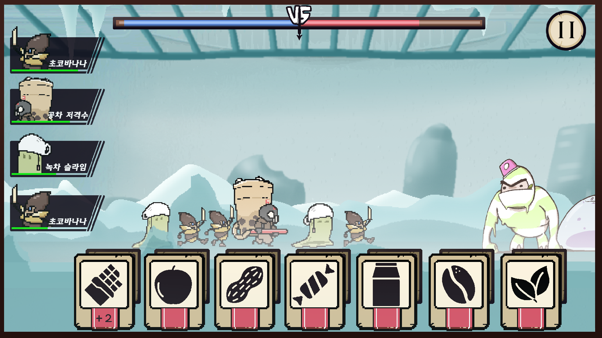
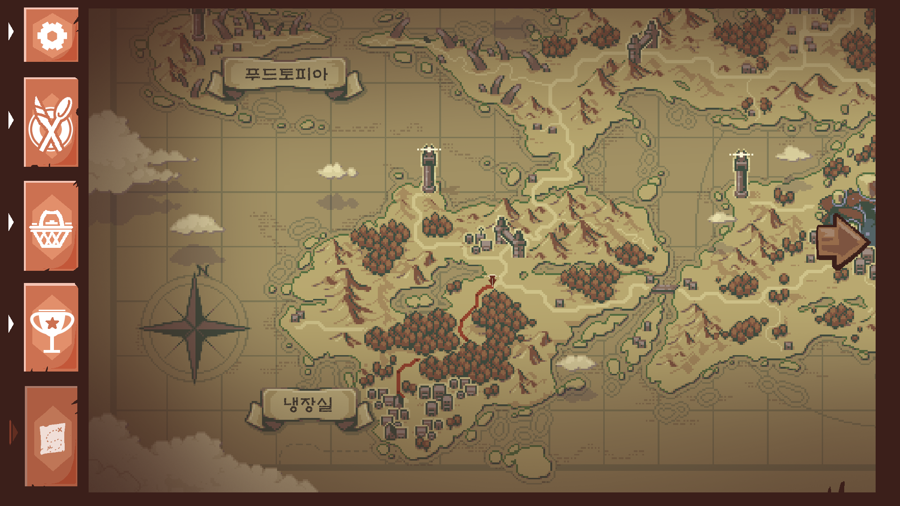

# Team-AND
  

## 게임 종합 정보  
### 게임 제목  
프로젝트 슈가 러시(가칭)

### 게임 소개
아기자기하고 눈길이 가는 디저트 캐릭터들이 등장한다. 독특한 매력을 지닌 다양한 디저트 캐릭터들로 몰려오는 적을 격퇴해가며 세계를 탐험하자.

### 게임 정보
출시 예정: 2025년 10월  
발매 기종: Android/iOS  
장르: 캐주얼 오펜스 게임  
언어: 한국어, 영어 

### 게임 컨셉 아트
  

### 게임 플레이 영상
추후 업로드

## 개발 정보
### 팀 구성  
성명 | 이메일 | 담당
------|-------|-------
김민제 | elliot4895@gmail.com | 팀장, 기획  
박상우 | psw991102@naver.com | 기획, 스토리  
박상혁 | blazerod92@gmail.com | 아트  
권일준 | jonkwon99@naver.com | 프로그래밍, 문서정리  
김민철 | mc3833@naver.com | 프로그래밍  

### Tech Stack
문서 관리 및 협력 툴  

   

개발 툴  

 

프로그래밍 언어  

### 외부 사이트
[Notion](https://www.notion.so/Team-AND-789218b160824b5d9d1c33fd984d1a8d)
